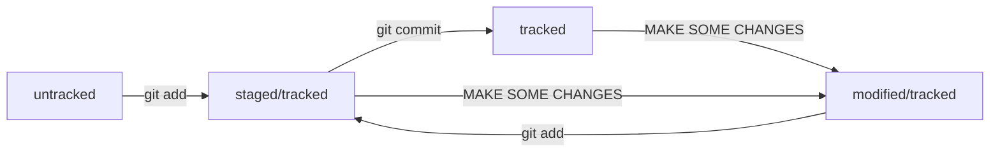

# A short tutorial about git base  
---
## Making repository  
1. Make local repo  
```bash  
mkdir localrepo  
```  
2. Go inside it  
```bash
cd localrepo  
```  
3. Initial git repository  
```bash  
git init  
```  

## Making commit  
1. Add file with changes to index  
```bash  
git add filewithchanges.txt  
```  
2. Make commit  
```bash  
git commit -m "Commit description"
```  

## Add to remote repository on a GitHub  
1. Create repository on a GitHub  
2. Attache local with remote repository  
```bash  
git remote add origin https://github.com/youraccount/remoterepo.git  
```
3. Push your commits  
```bash  
git push -u origin main  
```

## About hash  
Hash is a fingerprint of a commit made with SHA-1


All hashes and table of hash-commit relatives git store in .git repository

## Call log  
With call 
```bash  
git log  
```
we get a list with information about commits. Every block include commit hash, author, date and time, commit messenge

## Call short log  
We can call 
```bash
git log --oneline
```
to watch records includes short hash and commit messenge

## HEAD  
HEAD - is file at .git. It contains link on last commit hash. On the other word HEAD is alias for last commit for git commands.

## File lifecycle in git


## Let's see 
```bash
git status
```

1. If nothing were changed we will see 
```bash
$ git status  
On branch master  
nothing to commit, working tree clean  
```

2. If git find untracked files  
```bash
$ git status  
On branch master  
Untracked files: # найдены неотслеживаемые файлы  
  (use "git add <file>..." to include in what will be committed)  
        fileA.txt  

nothing added to commit but untracked files present (use "git add" to track)  
```  

3. After add untracked with git add  
```bash
$ git status  
On branch master  
Changes to be committed:  
  (use "git restore --staged <file>..." to unstage)  
        new file:   fileA.txt 
```

4. After commiting changes from last point  
```bash
$ git status  
On branch master  
nothing to commit, working tree clean  
```

5. When git find non-commited changes  
```bash
$ git status  
On branch master  
Changes not staged for commit:  
  (use "git add <file>..." to update what will be committed)  
  (use "git restore <file>..." to discard changes in working directory)  
        modified:   fileA.txt  
```  
After call  
```bash
git add
```  

```bash
$ git status
On branch master  
Changes to be committed:  
  (use "git restore --staged <file>..." to unstage)  
        modified:   fileA.txt  
```

6.When file was changed after git add  
```bash
$ git status  
On branch master  
Changes to be committed:  
  (use "git restore --staged <file>..." to unstage)  
          modified:   fileA.txt  


Changes not staged for commit:  
  (use "git add <file>..." to update what will be committed)  
  (use "git restore <file>..." to discard changes in working directory)  
          modified:   fileA.txt  
```  

